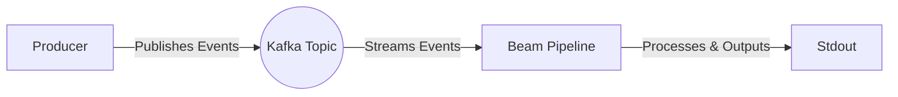
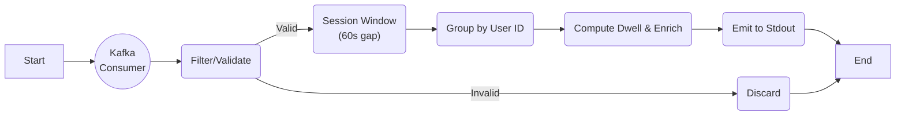

# Web Analytics Pages Viewed


## Table of Contents

- [Description](#description)
- [Project Structure](#project-structure)
- [Pre-requisites](#pre-requisites)
- [Installation](#installation)
- [Usage](#usage)
- [Data Model](#data-model)
- [Architecture](#architecture)
- [Contributions](#contributions)
- [License](#license)
- [Tests](#tests)
- [Acknowledgements](#acknowledgements)
- [Supporting References](#supporting-references)

## Description

Processes synthetic web page view events and calculates the time a user spends on pages in a streaming manner. A Python producer emits synthetic `page_view` events into Kafka; a Java Apache Beam (DirectRunner) pipeline reads, sessions (60s gap), enriches, and outputs per-page dwell times.

## Project Structure

- `services/java-pipeline`
    - `src/main/java/com/example`: pipeline transforms (`ReadFromKafka`, `ValidateEvents`, `FilterEvents`, `AggregateEvents`, `WebAnalyticsPipeline`)
    - `src/main/java/com/example/model`: POJO models (`Event`, `EventParams`)
- `services/producer`: Python Kafka producer for synthetic events
- `infrastructure/docker/docker-compose.yml`: Zookeeper, Kafka, producer services
- `assets/`: images used in docs

### Pre-requisites

| Software | Version |
| --- | --- |
| OpenJDK | `11` |
| Maven | `3.6+` |
| Docker | `latest` |

## Installation

Build the Java pipeline (shaded jar):

```bash
cd services/java-pipeline
mvn clean package
```

## Usage

1. Start Docker Desktop.
2. Start Zookeeper, Kafka, and the producer:

     ```bash
     docker-compose -f infrastructure/docker/docker-compose.yml up -d
     ```

     Kafka listeners:
     - Internal (containers): `kafka:9092`
     - Host: `localhost:29092`

3. Verify messages are flowing:

     ```bash
     docker exec -it kafka-node kafka-console-consumer \
         --bootstrap-server localhost:9092 \
         --topic web-analytics-events \
         --from-beginning --max-messages 5
     ```

4. Run the Beam pipeline from the host (uses `localhost:29092` by default):

     ```bash
     java -jar services/java-pipeline/target/web-analytics-pages-viewed-java-0.1-shaded.jar
     ```

## Data Model

### Incoming Payload

Specification:

```json
{
    "event_name":           "[Required] Name of event. Always page_view for this pipeline",
    "user_id":              "[Required] Unique user id",
    "page_id":              "[Required] Idenifier for the web page",
    "timestamp_ms":         "[Required] Timestamp in micros when the event occurred",
    "event_params": {
        "engaged_time":     "[Optional] Seconds the user was engaged on the page",
        "page_title":       "[Optional] User friendly, free-text title of the page",
        "traffic_source":   "[Optional] Channel arrived to the website persisting per session",
        "test_event":       "[Required] Boolean; true events are filtered out downstream"
    }
}
```

Example:

```json
{
    "event_name": "page_view",
    "user_id": "user_6",
    "page_id": "page_11",
    "timestamp_ms": 1752999940667,
    "event_params": {
        "engaged_time": 5,
        "page_title": "Title for page_13",
        "traffic_source": "organic",
        "test_event": false
    }
}
```

### Output Payload (enriched)

`timestamp_ms` is used internally for calculations and removed from the emitted event.

Specification:

```json
{
    "event_name":           "[Required] Name of event. Always page_view for this pipeline",
    "user_id":              "[Required] Unique user id",
    "page_id":              "[Required] Idenifier for the web page",
    "timestamp_ms":         "[Required] Timestamp in micros when the event occurred",
    "event_params": {
        "engaged_time":     "[Optional] Seconds the user was engaged on the page",
        "page_title":       "[Optional] User friendly, free-text title of the page",
        "traffic_source":   "[Optional] Channel arrived to the website persisting per session"
    },
    "processing_timestamp_iso": "[Required] Timestamp the event was processed. This shows the processing lag of the even",
    "time_spent_on_page_seconds": "[Required] Amount of seconds the page was viewed by the user",
    "sequence_number": "[Required] The number the page was viewed in the sequence"
}
```

Example:

```json
{
    "event_name": "page_view",
    "user_id": "user_6",
    "page_id": "page_11",
    "timestamp_iso": "2025-12-13T21:22:57.046Z",
    "processing_timestamp_iso": "2025-12-13T21:22:59.078Z",
    "time_spent_on_page_seconds": 4.616,
    "sequence_number": 2,
    "session_id": "c8b9fe45-f2ed-461a-9221-47691136ea50",
    "previous_timestamp_iso": "2025-12-13T21:22:57.046Z",
    "event_params": {
        "engaged_time": 5,
        "page_title": "Title for page_13",
        "traffic_source": "organic",
        "test_event": false
    }
}
```

Notes:

- Session windows use a 60s inactivity gap with early firing at +30s after first element per pane.
- Validation: drop events missing `event_params`, missing/empty `page_title`, or missing `test_event`; filtering removes events where `test_event == true`.
- `time_spent_on_page_seconds`: for each sorted session, interior events use the gap to the next event; the final event in the session falls back to its `engaged_time` value (else `0`).

## Architecture

### Process Flow



- Producer publishes JSON messages keyed by `user_id`.
- Kafka broker is exposed internally as `kafka:9092` and to the host as `localhost:29092`.

### Pipeline Design



---

## Contributions

We welcome contributions to this project. Please follow these steps:

- Create a new branch (git checkout -b feature/your-feature)
- Commit your changes (git commit -am 'Add some feature')
- Push to the branch (git push origin feature/your-feature)
- Create a new pull request

## License

This project is licensed under the terms of the [MIT License](LICENSE).

## Tests

To run tests:

```bash
cd services/java-pipeline
mvn test
```

Tests are not yet implemented; planned for a future release.

## Acknowledgements

Author: Aaron Ginder | [aaronginder@hotmail.co.uk](mailto:aaronginder@hotmail.co.uk)

## Supporting References

**Create Kafka topic:**

```bash
docker exec kafka-node kafka-topics.sh --create \
    --topic web-analytics-events \
    --bootstrap-server localhost:9092 \
    --partitions 1 --replication-factor 1
```

**List Kafka topics:**

```bash
docker exec kafka-node kafka-topics.sh --list --bootstrap-server localhost:9092
```

**Consume messages from topic:**

```bash
docker exec kafka-node kafka-console-consumer.sh \
    --bootstrap-server localhost:9092 \
    --topic web-analytics-events \
    --from-beginning
```
