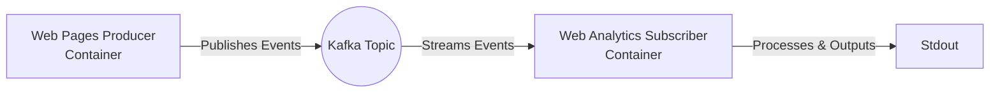

# Web Analytics Pages Viewed


## Table of Contents

- [Description](#description)
- [Project Structure](#project-structure)
- [Pre-requisites](#pre-requisites)
- [Installation](#installation)
- [Usage](#usage)
- [Data Model](#data-model)
- [Architecture](#architecture)
- [Contributions](#contributions)
- [License](#license)
- [Tests](#tests)
- [Acknowledgements](#acknowledgements)
- [Supporting References](#supporting-references)

## Description

Processes synthetic web page view events and calculates the time a user has spent on the page in a streaming manner. Events will be emitted as outputs to show how long a user has been viewing a page within a sequence.

## Project Structure

- `src/pipeline/`: Data pipeline implementation
- `src/transformations/`: Data transformation logic
- `src/validation/`: Data validation rules

### Pre-requisites

| Software      | Version       |
|---------------|---------------|
| Python        | `^3.12`       |

## Installation

Execute the commands below to install the python packages.

```bash
pip install poetry;

poetry install;
```

## Usage

:rocket: Coming soon!

## Data Model

:rocket: Coming soon!

## Architecture



---

## Contributions

We welcome contributions to this project. Please follow these steps:

- Create a new branch (git checkout -b feature/your-feature)
- Commit your changes (git commit -am 'Add some feature')
- Push to the branch (git push origin feature/your-feature)
- Create a new pull request

## License

This project is licensed under the terms of the [MIT License](LICENSE).

## Tests

:rocket: Coming soon!

## Acknowledgements

Author: Aaron Ginder | [aaronginder@hotmail.co.uk](mailto:aaronginder@hotmail.cp.uk)

## Supporting References

:rocket: Coming soon!
