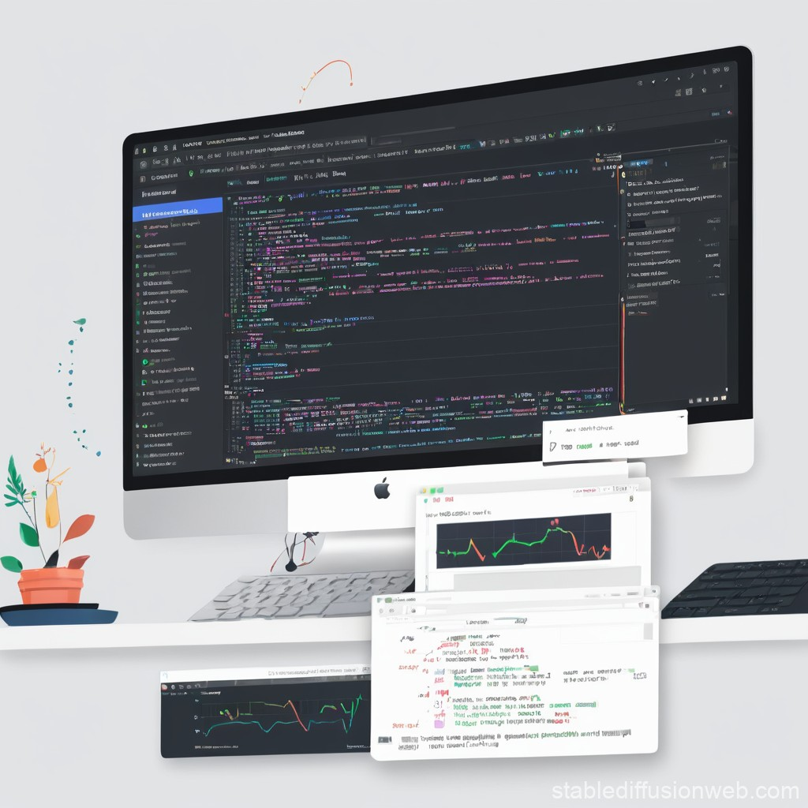
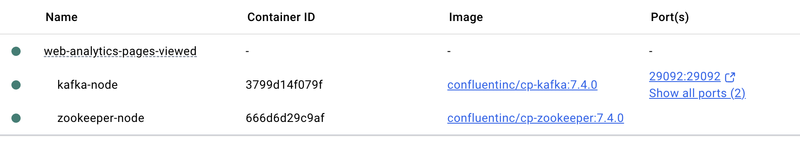
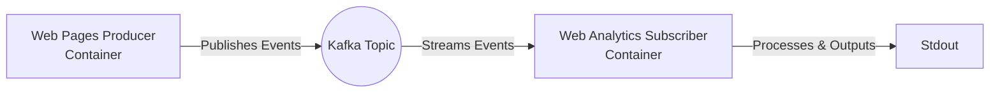
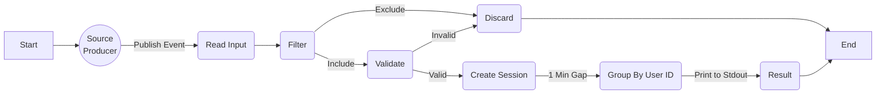

# Web Analytics Pages Viewed



## Table of Contents

- [Description](#description)
- [Project Structure](#project-structure)
- [Pre-requisites](#pre-requisites)
- [Installation](#installation)
- [Usage](#usage)
- [Data Model](#data-model)
- [Architecture](#architecture)
- [Contributions](#contributions)
- [License](#license)
- [Tests](#tests)
- [Acknowledgements](#acknowledgements)
- [Supporting References](#supporting-references)

## Description

Processes synthetic web page view events and calculates the time a user has spent on the page in a streaming manner. Events will be emitted as outputs to show how long a user has been viewing a page within a sequence.

## Project Structure

- `web-analytics-pages-viewed-java`: a Java implementation of the analytics pipeline
- `src/main/java/com/example`: data pipeline code
- `src/main/java/com/example`: data pipeline test code
- `pom.xml`: Maven project configuration
- `docker-compose.yml`: Docker configuration for Kafka and Zookeeper

### Pre-requisites

| Software      | Version       |
|---------------|---------------|
| OpenJDK       | `11`          |
| Maven         | `3.6+`        |
| Docker        | `latest`      |

## Installation

Execute the commands below to install the python packages.

```bash
cd web-analytics-pages-viewed-java;
mvn clean package;
```

## Usage

1. Start your Docker daemon

2. Start the Zookeeper and Kafka broker where source messages will be published into: `docker-compose up kafka -d`

3. Start the producer container to publish messages into the kafka broker you just started: `docker-compose up producer -d`

4. Execute the Apache Beam pipeline locally or execute the jar: `java -jar web-analytics-pages-viewed-java/target/web-analytics-pages-viewed-java-bundled-0.1.jar`



## Data Model

### Incoming Payload

```json
{
    "event_name":           "[REQUIRED] Name of event. Always page_view for this pipeline",
    "user_id":              "[REQUIRED] Unique user id",
    "page_id":              "[REQUIRED] Idenifier for the web page",
    "timestamp_ms":         "[REQUIRED] Timestamp in micros when the event occurred",
    "event_params": {
        "engaged_time":     "[OPTIONAL] Seconds the user was engaged on the page",
        "page_title":       "[OPTIONAL] User friendly, free-text title of the page",
        "traffic_source":   "[OPTIONAL] Channel arrived to the website persisting per session"
    }
}
```

Sample payload:

```json
{
    "event_name": "page_view",
    "user_id": "user_6",
    "page_id": "page_11",
    "timestamp_ms": 1752999940667,
    "event_params": {
        "engaged_time": 5,
        "page_title": "Title for page_13",
        "traffic_source": "organic"
    }
}
```

### Output Payload

```json
{
    "event_name":                   "[REQUIRED] Name of event. Always page_view for this pipeline",
    "user_id":                      "[REQUIRED] Unique user id",
    "page_id":                      "[REQUIRED] Idenifier for the web page",
    "timestamp_ms":                 "[REQUIRED] Timestamp in micros when the event occurred",
    "time_spent_on_page_seconds":   "[REQUIRED] Duration the user spent on a web page in seconds",
    "sequence_number":              "[REQUIRED] The ordinal position of the page during the session",
    "session_id":                   "[REQUIRED] Unique session identifier",
    "event_params": {
        "engaged_time":             "[OPTIONAL] Seconds the user was engaged on the page",
        "page_title":               "[OPTIONAL] User friendly, free-text title of the page",
        "traffic_source":           "[OPTIONAL] Channel arrived to the website persisting per session"
    }
}
```

Sample payload:

```json

```

## Architecture

### Process Flow



- A Docker container executing a Python application to publish events into a Kafka topic within 5 seconds (based on a random uniform distribution). Each message is a JSON payload and the message is published with the `user id` as the key

### Pipeline Design



---

## Contributions

We welcome contributions to this project. Please follow these steps:

- Create a new branch (git checkout -b feature/your-feature)
- Commit your changes (git commit -am 'Add some feature')
- Push to the branch (git push origin feature/your-feature)
- Create a new pull request

## License

This project is licensed under the terms of the [MIT License](LICENSE).

## Tests

To run tests:

```bash
cd web-analytics-pages-viewed-java;
mvn test;
```

:soon: Tests have not yet been written for this repository. They will be written in a future release.

## Acknowledgements

Author: Aaron Ginder | [aaronginder@hotmail.co.uk](mailto:aaronginder@hotmail.cp.uk)

## Supporting References

**Create Kafka topic:**

```bash
docker exec kafka-node kafka-topics.sh --create --topic web-analytics-events --bootstrap-server localhost:9092 --partitions 1 --replication-factor 1
```

**List Kafka topics:**

```bash
docker exec kafka-node kafka-topics.sh --list --bootstrap-server localhost:9092
```

**Consume messages from topic:**

```bash
docker exec kafka-node kafka-console-consumer.sh --bootstrap-server localhost:9092 --topic web-analytics-events --from-beginning
```
