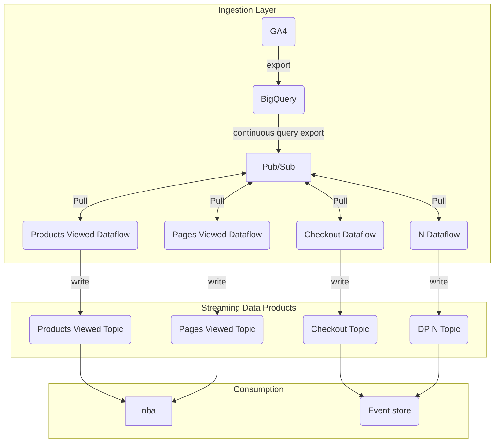
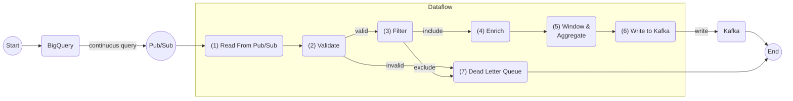

# Pages Viewed Streaming Pipeline

<div>
  
</div>

## Table of Contents

- [Data Product Information](#data-product-information)
  - [Description](#description)
  - [Definitions](#definitions)
  - [Pre-requities](#pre-requities)
- [Architecture](#architecture)
  - [Component Design](#component-design)
  - [Pipeline Design](#pipeline-design)
  - [Event Structure](#event-structure)
    - [Source Topic Message Body](#source-topic-message-body)
    - [Source Topic Message Attributes](#source-topic-message-attributes)
    - [Output Topic Message Body](#output-topic-message-body)
    - [Output Topic Message Attributes](#output-topic-message-attributes)
  - [Late Event Handling](#late-event-handling)
  - [Performance & Optimisation](#performance--optimisation)
- [Usage](#usage)
  - [Basic Usage](#basic-usage)
  - [Production Usage](#production-usage)
  - [Configuration Options](#configuration-options)
- [Testing](#testing)
  - [Test Cases](#test-cases)
  - [Running Tests](#running-tests)
- [Contributions](#contributions)
  - [Development Setup](#development-setup)
  - [Local Development](#local-development)
  - [Code Structure](#code-structure)
- [Acknowledgements](#acknowledgements)
- [Next Steps](#next-steps)
- [Supporting References](#supporting-references)

---

## Data Product Information

🔑 Key Features:

- Real-time streaming pipeline for calculating time spent on pages
- Session-based windowing for user behavior analysis
- Handles late-arriving events with configurable watermarks
- Scalable Apache Beam/Dataflow implementation

### Description

This streaming pipeline processes GA4 page view events to calculate time spent on each page within user sessions. It reads events from Pub/Sub, validates and filters them, then uses session-based windowing to group events by user sessions and calculate time differences between consecutive page views.

### Definitions

- **Session**: A group of user interactions within a time window, defined by a gap of inactivity
- **Time on Page**: Duration between consecutive page view events within a session
- **Watermark**: Mechanism to handle late-arriving events in streaming processing
- **Session Window**: Dynamic window that extends with each new event until a gap threshold is reached

### Pre-requities

- Python 3.9+
- Apache Beam SDK
- Google Cloud SDK
- Access to BigQuery and Pub/Sub
- Poetry for dependency management

## Architecture

### Component Design



### Pipeline Design



1. **Read From Pub/Sub**: Ingests GA4 page view events from subscription
2. **Validate**: Ensures events have required fields (session_id, ga_event_dtm, page_title)
3. **Filter**: Applies business logic filters (optional customer_id filtering)
4. **Enrich**: Adds additional metadata or derived fields
5. **Window & Aggregate**: Groups events by session and calculates time on page
6. **Write to Kafka**: Outputs results to downstream systems

### Event Structure

#### Source Topic Message Body

```json
{
  "session_id": "1234567890.1738286883",
  "page_title": "Home Page",
  "subscriber_number": "12345678",
  "subscriber_lifetime_id": "abc123",
  "account_number": "ACC123456",
  "digital_id": "DIG789",
  "single_id": "SID456",
  "user_id": "USER123",
  "user_pseudo_id": "2JK8WSrazodfn8PgRDYzuzoQrA2MzjogfSwFkKDbLBY=.1738286883",
  "event_date": "2025-01-30",
  "event_timestamp_ms": 1738286883000,
  "ga_event_dtm": "2025-01-30T15:30:00Z",
  "event_name": "page_view",
  "event_params": [
    {
      "key": "page_title",
      "value": {"string_value": "Home Page"}
    }
  ]
}
```

#### Source Topic Message Attributes

```json
{
  "timestamp": "2025-01-30T15:30:00Z",
  "source": "ga4_streaming"
}
```

#### Output Topic Message Body

```json
{
  "session_id": "1234567890.1738286883",
  "page": "Home Page",
  "time_spent_seconds": 45.5,
  "timestamp": "2025-01-30T15:30:45Z",
  "window_start": "2025-01-30T15:30:00Z",
  "window_end": "2025-01-30T15:31:45Z",
  "element_timestamp": "2025-01-30T15:30:45Z"
}
```

#### Output Topic Message Attributes

```json
{
  "session_id": "1234567890.1738286883",
  "processing_time": "2025-01-30T15:31:00Z"
}
```

### Late Event Handling

The pipeline handles late-arriving events using:

- **Allowed Lateness**: 0 seconds (configurable)
- **Watermark Strategy**: Uses *processing time* for historic data to ensure progression
- **Triggers**: Early triggers every 30 seconds for real-time results
- **Accumulation Mode**: ACCUMULATING to maintain complete session context

### Performance & Optimisation

- **Session Windows**: Automatically scale with user activity patterns
- **Stateful Processing**: Tracks emitted results to avoid duplicates
- **Proxy Configuration**: Optimized for corporate network environments
- **Memory Management**: Efficient event sorting and processing
- **Parallel Processing**: Leverages Beam's auto-scaling capabilities

## Usage

### Basic Usage

```bash
python -m dataflow.main \
  --input_subscription=projects/aaronginder/subscriptions/pages_view_events_dp \
  --runner=DirectRunner \
  --streaming
```

### Production Usage

```bash
python -m dataflow.main \
  --input_subscription=projects/aaronginder/subscriptions/pages_view_events_dp \
  --runner=DataflowRunner \
  --project=your-project-id \
  --region=europe-west2 \
  --temp_location=gs://your-bucket/temp \
  --streaming
```

### Configuration Options

- `--input_subscription`: Pub/Sub subscription path
- `--customer_id_filter`: Optional customer ID filter
- `--window_size`: Session gap size in seconds (default: 60)
- `--runner`: Beam runner (DirectRunner, DataflowRunner)

## Testing

### Test Cases

| Test Case | Input | Expected Output | Status |
|-----------|-------|----------------|--------|
| Single session, 2 events | Events 30s apart | time_spent_seconds: 30 | :x: |
| Multiple sessions | Different session_ids | Separate calculations | :x: |
| Late events | Event arrives after window | Handled by watermark | :x: |
| Invalid events | Missing session_id | Filtered out | :x: |
| Historic data | Old timestamps | Uses processing time | :x: |

### Running Tests

```bash
# Unit tests
python -m pytest tests/

# Integration tests
python -m pytest tests/integration/

# Load testing
python samples/publish_to_pubsub.py
```

## Contributions

### Development Setup

1. Clone repository
2. Install dependencies: `poetry install`
3. Configure proxy settings in environment
4. Set up Google Cloud credentials
5. Run tests: `pytest`

### Local Development

```bash
# Install dependencies
poetry install

# Run locally
python -m dataflow.main --runner=DirectRunner --streaming

# Publish test data
jupyter notebook samples/publish_to_pubsub.ipynb
```

### Code Structure

```text
pages-viewed-streaming/
├── .gitlab_templates/
│   └── terraform.yml                    # GitLab CI template for Terraform
├── assets/
│   └── header.png                       # README header image
├── pipelines/
│   └── pages_viewed_streaming/
│       ├── config/
│       │   └── pipeline_config.yaml.jinja  # Pipeline configuration template
│       ├── dataflow/
│       │   ├── io/
│       │   │   ├── read_from_pubsub.py      # Pub/Sub input connector
│       │   │   └── write_to_kafka.py        # Kafka output connector
│       │   ├── transforms/
│       │   │   ├── aggregate.py             # Time calculation transform
│       │   │   ├── enrich.py                # Event enrichment transform
│       │   │   ├── filter.py                # Event filtering transform
│       │   │   └── validate.py              # Event validation transform
│       │   ├── main.py                      # Pipeline entry point
│       │   ├── options.py                   # Pipeline options and arguments
│       │   └── schemas.py                   # Data schemas and validation
│       ├── docker/
│       │   └── kafka/
│       │       ├── create-topics.sh         # Kafka topic creation script
│       │       ├── delete-topics.sh         # Kafka topic deletion script
│       │       ├── Dockerfile               # Kafka container configuration
│       │       └── kafka-entrypoint.sh      # Kafka startup script
│       ├── tests/
│       │   └── .gitkeep                     # Placeholder for test files
│       ├── utils/
│       │   └── .gitkeep                     # Placeholder for utility files
│       ├── docker-compose.yml               # Local development environment
│       ├── poetry.lock                      # Poetry dependency lock file
│       ├── pyproject.toml                   # Poetry project configuration
│       └── setup.py                         # Python package setup
├── samples/
│   └── publish_to_pubsub.ipynb             # Test data publisher notebook
├── terraform/
│   ├── infra/
│   │   ├── backend.tf                       # Terraform backend configuration
│   │   ├── main.tf                          # Main infrastructure resources
│   │   ├── outputs.tf                       # Terraform outputs
│   │   ├── variables.tf                     # Terraform variable definitions
│   │   └── versions.tf                      # Terraform version constraints
│   ├── common.yaml.jinja                    # Common Terraform variables template
│   ├── data.yaml.jinja                      # Data environment variables template
│   ├── jinja_variables.yaml                 # Jinja template variables
│   ├── proc.yaml.jinja                      # Processing environment variables template
│   ├── variables.sh                         # Shell script for environment variables
│   └── variables.tfvars                     # Terraform variable values
├── .coveragearc                             # Coverage configuration
├── .gitignore                               # Git ignore patterns
├── .gitlab-ci.yml                           # GitLab CI/CD pipeline
├── .markdownlint.json                       # Markdown linting configuration
├── poetry.lock                              # Root Poetry dependency lock file
├── pyproject.toml                           # Root Poetry project configuration
├── README.md                                # Project documentation
├── requirements-dev.txt                     # Development dependencies
└── requirements.txt                         # Production dependencies
```

## Acknowledgements

- Apache Beam community for streaming framework
- Google Cloud Dataflow for managed execution
- GA4 for providing rich event data
- Author: Aaron Ginder

## Next Steps

- ‼️add enrichment ptransform with side input lookups for account number / standardise page lookup
- ‼️ update filter logic for relevant filtration based on user expectations
- ‼️ add persistence upstream or within this pipeline using stateful processing
- ‼️ deploy Pub/Sub topic with schema defining structure of events pubished into the topic
- ❗ add pipeline configurations and integrate within pipeline
- ❗write unit and integration tests as part of deployment

## Supporting References

- [Apache Beam Programming Guide](https://beam.apache.org/documentation/programming-guide/)
- [Google Cloud Dataflow Documentation](https://cloud.google.com/dataflow/docs)
- [GA4 Event Structure](https://developers.google.com/analytics/devguides/collection/ga4/reference/events)
- [Session Windows in Beam](https://beam.apache.org/documentation/programming-guide/#session-windows)
